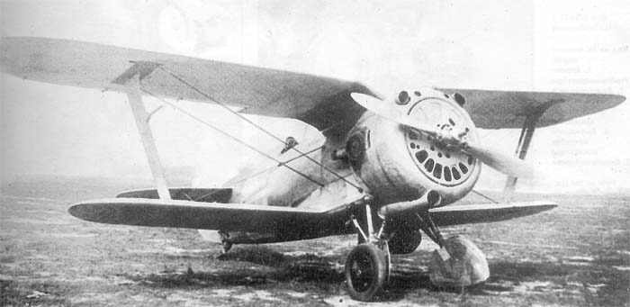

# Budget Planner

###### Aka `bplan`, aka biplane



###### pending description...

``` shell
git clone --recurse --shallow-submodules "https://github.com/Challanger524/bplan"
```

> Boost source dir path must be passed to cmake via:
> - `"cmake.configureArgs":["-D_BOOST_SOURCE_DIR_=${workspaceFolder}/../boost"]` or
> - `-D_BOOST_SOURCE_DIR_=../boost` or
> - `-C cache.cmake` contained: `set(_BOOST_SOURCE_DIR_ "${CMAKE_SOURCE_DIR}/../boost" CACHE STRING "path to boost source folder" FORCE)`
