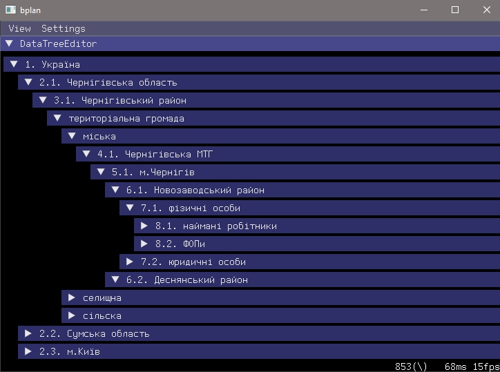

# Budget Planner

###### Aka `bplan`, aka biplane


###### pending description...

``` shell
git clone --recurse --shallow-submodules "https://github.com/Challanger524/bplan"
```

## Showcase

<details open><summary>Tests:</summary>

<p align="center"><br><em>Bplan test: country</em></p>

</details>
