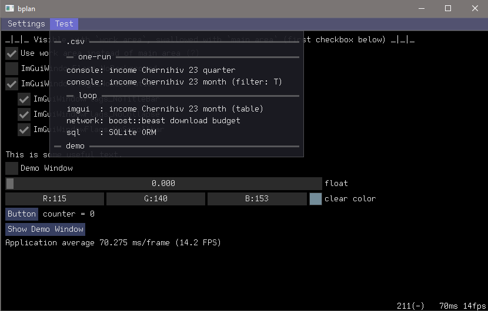
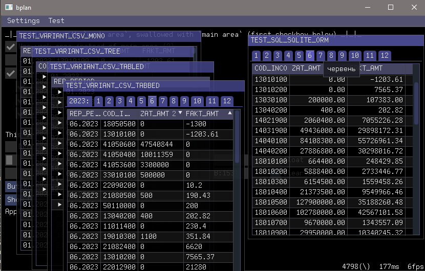
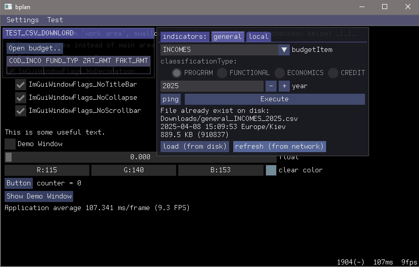
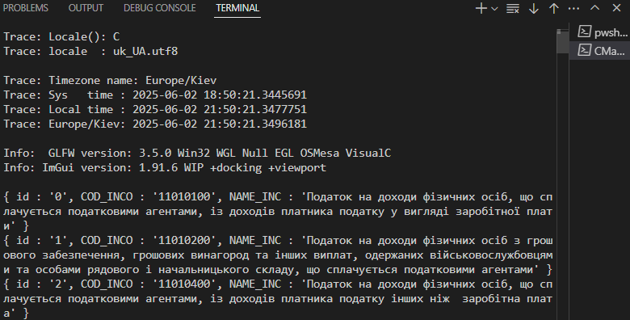

# Budget Planner

###### Aka `bplan`, aka biplane


Cross-platform application aiming to connect to openbudget.gov.ua using **public API** to get budget data shipped in **`.csv`** files to process them with **STL** and graphically view with **Dear ImGui**.

`git` (`submodules`) `CMake` (`CMakePresets`) `vcpkg` `C++` `C++23` `STL` (`type traits` `concepts` `ranges` `locale` `chrono` `span`) `Boost` (`beast` `locale`) `Dear ImGui` `Rapidcsv` `SQLite` `SQLite ORM` `multicompliler` (`MSVC` `GCC` `Clang` `MSYS2`: `mingw64/gcc` `clang64/clang`) `cross-platform`(`Linux` `Windows` `MinGW` `MSYS2`) `EditorConfig`

## Clone
``` shell
git clone --recurse --shallow-submodules "https://github.com/Challanger524/bplan"
```

## Prerequisites
- **vcpkg** package manager to configure preset `MSVC` on windows
- **Boost** source path must be passed to CMake to build with `MSYS2`: `GCC` and `Clang`:

    <details><summary>examples</summary>

    > - VS Code: `.code-workspace`: `"cmake.configureArgs":["-D_BOOST_SOURCE_DIR_=${workspaceFolder}/../boost"]`, or
    > - `-D_BOOST_SOURCE_DIR_=../boost`, or via _cahche_ file
    > - `-C cache.cmake`, file `cache.cmake` containing:
    >   - `set(_BOOST_SOURCE_DIR_ "${CMAKE_SOURCE_DIR}/../boost" CACHE STRING "path to boost source folder" FORCE)`
    </details>

- **SQLite** must be properly installed to be visible to `find_package()`:

    <details><summary>Windows</summary>

    > `lib/` and `/include` with SQLite binaries must be visible in `PATH`:
    > - Reply #3 (marked as solution) + Reply #5 from: https://discourse.cmake.org/t/correct-usage-of-findsqlite3-module-in-windows/174
    </details>

## Build
Pick one of the compiler build preset:
- `0. MSVC - debug`
- `1. GCC - debug`
- `2. Clang - debug`
- `2. Clang - sanitize=address`

CMake should do the rest.

## Notes
`.code-workspace` checked in intentionally and going to be merged with `.vscode/settings.json` later . .

## Screenshots





